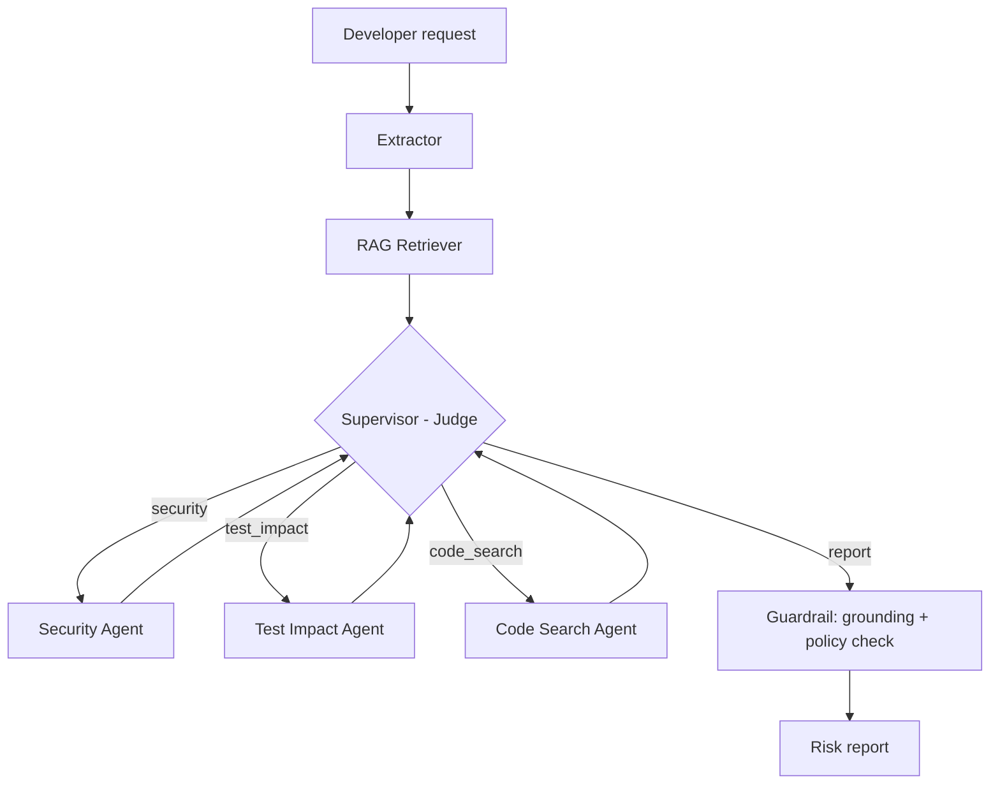
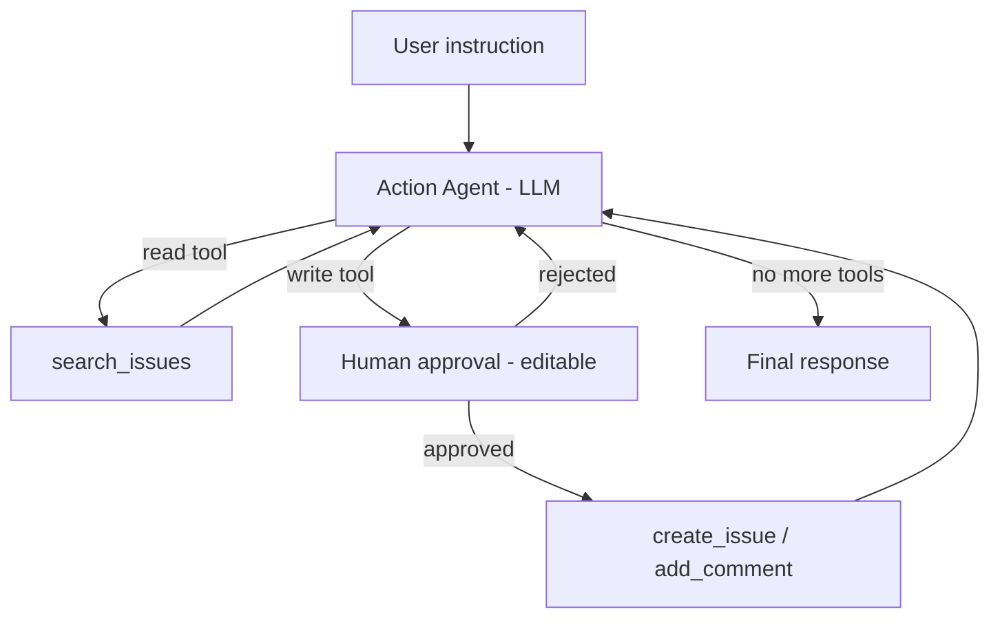

# ChangeRisk AI

Multi-agent LangGraph system that analyzes proposed code changes against a codebase, its tests, and security policies, then lets a tool-calling agent act on the result in GitHub. Every write action pauses for human approval, and the reviewer can edit it before it runs.

## Overview

A developer describes a change, for example: *"Increase the session timeout from 30 minutes to 2 hours for logged-in users."*

ChangeRisk AI works in two phases:

1. **Analysis.** Relevant context is retrieved from the indexed codebase, tests, and security policies. An LLM judge-supervisor routes the request to specialist agents. Each specialist explicitly compares the proposed change against any relevant rule or limit in the retrieved context, so a change that violates a stated policy is reported as a violation, not as compliant. The findings are combined into a risk report, then checked by a two-step guardrail before being shown.
2. **Action.** The developer chats with an action agent, for example *"File this as an issue."* The agent decides which GitHub tools to call. It always searches for an existing issue about the same change first, and comments on it instead of creating a duplicate. Any write action pauses for approval, with editable content, before it runs.

## Features

- **Judge-supervisor routing.** An LLM decides which specialist agent runs next, based on what is already known about the change. Once all three specialists have run, the supervisor moves straight to the report without an extra LLM call. A separate loop guard in the graph also forces the report if the judge ever repeats itself, so a bad decision can never cause an endless loop.
- **Specialist agents.** Security review, test impact analysis, and affected files/APIs. Each agent is instructed to explicitly compare the proposed change against any rule or limit stated in the retrieved context, rather than describing a policy-violating change as compliant.
- **Retrieval-augmented analysis.** Codebase, tests, and policy documents are indexed in ChromaDB using local, free embeddings.
- **Two-step guardrail.**
  1. A grounding check rejects a report that is empty or shares no real content with the retrieved context.
  2. A policy-compliance pass re-checks the finished report against the actual policy documents and silently corrects any point that contradicts them, so the model's general knowledge can add detail but can never override what the real policies say.
- **Tool-calling action agent.** The LLM chooses between `search_issues`, `create_issue`, and `add_comment`. It treats an existing issue as a duplicate if it concerns the same change request, even if the conclusion differs, and comments on it instead of creating a new one.
- **Human-in-the-loop.** Write tools pause with LangGraph `interrupt()`. The reviewer can edit the arguments (title, body, labels, comment text) before approving, and only the approved version runs. Read tools run automatically.
- **MCP integration.** The backend is an MCP client for GitHub's official hosted MCP server, not a custom-built wrapper around the GitHub API.
- **Live execution trace.** Every agent step, tool call, and tool result is streamed to the UI as it happens, showing which agent is currently running.
- **Observability.** Every run is traced in LangSmith.

## Architecture

### Analysis phase



The supervisor runs after every specialist and decides the next step. Once all three specialists have finished, it skips the LLM call and routes straight to the report. A loop guard in the graph provides a second safety net regardless of what the judge decides.

### Action phase



Read tools run automatically. Write tools call GitHub's MCP server only after approval. The agent runs one tool per turn, so a resumed approval can never repeat an earlier action.

## Tech stack

| Area              | Tool                                                                  |
| ----------------- | --------------------------------------------------------------------- |
| Orchestration     | LangGraph, LangChain                                                  |
| LLM               | Groq via`langchain-groq` (`openai/gpt-oss-120b`)                  |
| Retrieval         | ChromaDB,`sentence-transformers` (local embeddings, no API key)     |
| Human-in-the-loop | LangGraph`interrupt()` with a checkpointer                          |
| Guardrail         | Grounding check plus an LLM-based policy-compliance pass              |
| Tool integration  | MCP client (`langchain-mcp-adapters`) to GitHub's remote MCP server |
| Observability     | LangSmith                                                             |
| Backend           | FastAPI                                                               |
| UI                | Streamlit                                                             |
| Packaging         | Docker                                                                |

All services used have a free tier.

## Project structure

```
ChangeRisk AI/
├── app/
│   ├── main.py                  # FastAPI entry point
│   ├── api/
│   │   ├── routes_analysis.py   # /analyze-change/stream
│   │   └── routes_action.py     # /chat and /decision
│   ├── core/config.py           # environment configuration
│   ├── graph/
│   │   ├── state.py             # shared state passed between nodes
│   │   ├── nodes.py             # extractor, retrieval, and report nodes
│   │   └── build_graph.py       # analysis graph wiring and routing
│   ├── agents/
│   │   ├── supervisor.py        # judge that selects the next specialist
│   │   ├── security_agent.py
│   │   ├── test_impact_agent.py
│   │   ├── code_search_agent.py
│   │   ├── action_agent.py      # tool-calling agent with the approval gate
│   │   └── tools.py             # search_issues, create_issue, add_comment
│   ├── rag/
│   │   ├── embeddings.py
│   │   ├── vectorstore.py
│   │   ├── ingest.py            # builds the vector index
│   │   └── retriever.py
│   ├── mcp/
│   │   └── github_client.py     # MCP client for GitHub's MCP server
│   ├── guardrails/validators.py # grounding check + policy-compliance pass
│   ├── llm/groq_client.py
│   ├── models/schemas.py        # request models
│   └── services/
│       ├── change_service.py    # streams the analysis
│       └── action_service.py    # runs the action agent
├── data/                        # source documents to index (mock NeoPay payments platform)
│   ├── codebase_sample/
│   ├── security_policies/
│   └── docs/
├── chroma_db/                   # persisted vector index (generated)
├── scripts/
│   └── run_ingest.py            # index builder
├── ui/
│   ├── streamlit_app.py
│   └── static/robot.svg
├── .streamlit/config.toml       # UI theme
├── Dockerfile
├── .dockerignore
└── requirements.txt
```

## Getting started

### Prerequisites

- Python 3.11 or later
- A Groq API key (console.groq.com)
- A LangSmith API key (smith.langchain.com)
- A GitHub personal access token with the `repo` scope
- A GitHub repository to receive the issues

### Installation

```bash
git clone <repository-url>
cd "ChangeRisk AI"
python -m venv venv
venv\Scripts\activate          # Windows
# source venv/bin/activate     # macOS / Linux
python -m pip install -r requirements.txt
```

### Configuration

Create a `.env` file in the project root:

```
GROQ_API_KEY=your_groq_key
LANGCHAIN_API_KEY=your_langsmith_key
LANGCHAIN_TRACING_V2=true
LANGCHAIN_PROJECT=changerisk-ai
GITHUB_TOKEN=your_github_token
GITHUB_REPO=your-username/your-issues-repo
```

| Variable                 | Description                                                  |
| ------------------------ | ------------------------------------------------------------ |
| `GROQ_API_KEY`         | Groq API key used for all LLM calls                          |
| `LANGCHAIN_API_KEY`    | LangSmith API key                                            |
| `LANGCHAIN_TRACING_V2` | Set to`true` to enable LangSmith tracing                   |
| `LANGCHAIN_PROJECT`    | LangSmith project name                                       |
| `GITHUB_TOKEN`         | GitHub token used to authenticate with the GitHub MCP server |
| `GITHUB_REPO`          | Repository that receives issues, in`owner/repo` format     |
| `API_URL`              | UI only. Backend URL, defaults to`http://localhost:8000`   |

### Build the index

Place the codebase files, tests, and policy documents to analyze in `data/`, then run:

```bash
python scripts/run_ingest.py
```

The index is written to `chroma_db/`. To re-index after changing `data/`, delete `chroma_db/` first to avoid duplicate entries.

### Run

Start the backend:

```bash
uvicorn app.main:app --reload
```

In a second terminal, start the UI:

```bash
streamlit run ui/streamlit_app.py
```

| Service           | URL                        |
| ----------------- | -------------------------- |
| API documentation | http://localhost:8000/docs |
| UI                | http://localhost:8501      |

## API reference

All streaming endpoints return newline-delimited JSON events.

| Method | Endpoint                   | Description                                                                                                                                                                                                                 |
| ------ | -------------------------- | --------------------------------------------------------------------------------------------------------------------------------------------------------------------------------------------------------------------------- |
| GET    | `/health`                | Health check                                                                                                                                                                                                                |
| POST   | `/analyze-change/stream` | Runs the analysis. Events:`step` (finished steps and the next agent) and `done` (risk report and full execution log).                                                                                                   |
| POST   | `/chat`                  | Sends a message to the action agent. Body:`message`, `report`, and optional `thread_id`. Events: `start`, `message`, `tool_call`, `tool_result`, and `approval` (a write action is waiting for a decision). |
| POST   | `/decision`              | Resumes a paused action with the reviewer's decision. Body:`thread_id`, `approved`, and `args` (the possibly edited arguments). Same events as `/chat`.                                                             |

Example analysis request:

```json
{"change_request": "Increase the session timeout from 30 minutes to 2 hours for logged-in users"}
```

Example decision request:

```json
{"thread_id": "<thread_id from the start event>", "approved": true, "args": {"title": "...", "body": "...", "labels": ["security"]}}
```

## Testing

There is no automated test suite. The project was verified manually with the following scenarios, run through the UI against the live LLM and GitHub:

| Scenario                                                      | What it verifies                                                                                 |
| ------------------------------------------------------------- | ------------------------------------------------------------------------------------------------ |
| "Add UPI refund functionality to my payment system"           | RAG grounding, full specialist routing, analysis-to-report flow                                  |
| "Increase the session timeout from 30 minutes to 2 hours"     | The security agent correctly identifies a policy violation instead of describing it as compliant |
| "File this as an issue" after an analysis with no prior issue | `search_issues` finds nothing, `create_issue` runs after editable approval                   |
| "File this as an issue" after a matching issue already exists | `search_issues` finds the existing issue, `add_comment` runs instead of creating a duplicate |
| Rejecting a proposed action in the approval form              | No GitHub action is taken when the reviewer clicks Reject                                        |

## Deployment

### Backend (Docker)

```bash
docker build -t changerisk-ai .
docker run -p 8000:8000 --env-file .env changerisk-ai
```

The image contains the backend only. Provide the environment variables through the hosting platform rather than baking them into the image. The backend loads `sentence-transformers`, which needs roughly 1 GB of memory; choose a host with enough headroom for this.

### UI

The Streamlit UI can be hosted separately, for example on Streamlit Community Cloud. Set the `API_URL` environment variable (or Streamlit secret) to the deployed backend URL.

## Limitations

- Both graphs use an in-memory checkpointer, so a paused approval or an ongoing chat is lost if the backend restarts. For production, use a persistent checkpointer such as Postgres.
- The sample data in `data/` is a small mock payments platform used to demonstrate retrieval, not a real codebase.
- The policy-compliance guardrail corrects contradictions it finds, but it is an LLM-based check, not a formal verification, and is not a substitute for human review.
- GitHub's issue search is keyword-based, not semantic, and can occasionally miss a duplicate if the agent's query is worded very differently from the existing issue.
- There is no automated test suite; correctness was verified through the manual scenarios listed above.
