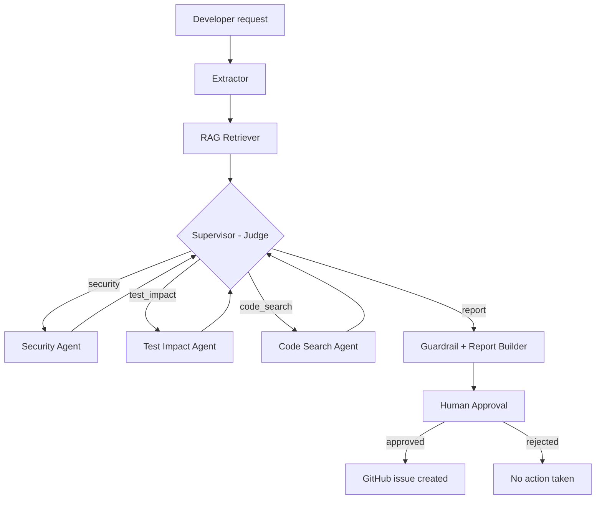

# ChangeRisk AI

Multi-agent LangGraph system that analyzes proposed code changes against a codebase, docs, and security policies. An LLM judge-supervisor routes the request to specialist agents, and a GitHub issue is filed only after human approval.

## What it does

A developer describes a change, for example: *"I want to add UPI refund functionality to my payment system."*

The system then:

1. Retrieves relevant context from the codebase, tests, and security policies (RAG).
2. Lets a judge-supervisor decide which specialist agent to run next.
3. Runs specialist agents for security, test impact, and affected code/APIs.
4. Builds one risk report and checks it is grounded in the retrieved evidence (guardrail).
5. Pauses for human approval.
6. If approved, files a GitHub issue containing the report.

Every step is recorded in an execution trace, so you can see exactly which agent ran and in what order.

## Architecture



The supervisor runs after every specialist and decides the next step. A safety check forces the report once all three specialists have run, so a bad LLM decision can never cause an endless loop.

## Tech stack

| Area | Tool |
|---|---|
| Orchestration | LangGraph, LangChain |
| LLM | Groq via `langchain-groq` (`openai/gpt-oss-120b`) |
| RAG | ChromaDB + `sentence-transformers` (local embeddings, no API key) |
| Human-in-the-loop | LangGraph `interrupt()` with checkpointer |
| Guardrail | Grounding check on the final report |
| Tool integration | GitHub Issues API (exposed through an MCP server) |
| Observability | LangSmith tracing |
| Backend | FastAPI |
| UI | Streamlit |
| Deployment | Docker |

All services used have a free tier.

## Project structure

```
ChangeRisk AI/
├── app/
│   ├── main.py                  # FastAPI entry point
│   ├── api/
│   │   ├── routes_analysis.py   # POST /analyze-change
│   │   └── routes_approval.py   # POST /approve
│   ├── core/config.py           # reads environment variables
│   ├── graph/
│   │   ├── state.py             # shared state passed between nodes
│   │   ├── nodes.py             # extractor, RAG, report, human approval nodes
│   │   └── build_graph.py       # wires the graph together
│   ├── agents/
│   │   ├── supervisor.py        # judge that picks the next specialist
│   │   ├── security_agent.py
│   │   ├── test_impact_agent.py
│   │   └── code_search_agent.py
│   ├── rag/
│   │   ├── embeddings.py
│   │   ├── vectorstore.py
│   │   ├── ingest.py            # builds the vector index
│   │   └── retriever.py
│   ├── mcp/
│   │   ├── github_tool.py       # creates the GitHub issue
│   │   └── mcp_server.py        # MCP wrapper around the tool
│   ├── guardrails/validators.py
│   ├── llm/groq_client.py
│   ├── models/schemas.py        # request/response models
│   └── services/change_service.py
├── data/                        # sample codebase, tests, security policy
├── scripts/run_ingest.py        # one-time index builder
├── ui/streamlit_app.py
├── Dockerfile
├── requirements.txt
└── .env.example
```

## Setup

### 1. Clone and install

```bash
git clone <your-repo-url>
cd "ChangeRisk AI"
python -m venv venv
venv\Scripts\activate          # Windows
# source venv/bin/activate     # macOS / Linux
python -m pip install -r requirements.txt
```

### 2. Configure environment variables

Create a `.env` file in the project root:

```
GROQ_API_KEY=your_groq_key
LANGCHAIN_API_KEY=your_langsmith_key
LANGCHAIN_TRACING_V2=true
LANGCHAIN_PROJECT=changerisk-ai
GITHUB_TOKEN=your_github_token
GITHUB_REPO=your-username/your-issues-repo
```

- Groq key: free at console.groq.com
- LangSmith key: free at smith.langchain.com
- GitHub token: a personal access token with the `repo` scope

### 3. Build the vector index (one time)

Put your codebase files, tests, and security policies inside `data/`, then run:

```bash
python scripts/run_ingest.py
```

Run it again whenever the files in `data/` change.

### 4. Start the backend

```bash
uvicorn app.main:app --reload
```

API docs: http://localhost:8000/docs

### 5. Start the UI (second terminal)

```bash
streamlit run ui/streamlit_app.py
```

UI: http://localhost:8501

## API endpoints

| Method | Endpoint | Purpose |
|---|---|---|
| GET | `/health` | Health check |
| POST | `/analyze-change` | Runs the graph until it pauses for approval. Returns `thread_id`, `risk_report`, and `execution_log`. |
| POST | `/approve` | Resumes the paused graph with the human decision (`thread_id`, `approved`). |

Example request:

```json
{"change_request": "I want to add UPI refund functionality to my payment system"}
```

Example approval:

```json
{"thread_id": "<thread_id from the previous response>", "approved": true}
```

## Run with Docker

```bash
docker build -t changerisk-ai .
docker run -p 8000:8000 --env-file .env changerisk-ai
```

## Notes

- The graph checkpointer is in-memory, so a paused request is lost if the server restarts. For production, swap it for a persistent checkpointer such as Postgres.
- The sample data in `data/` is a small mock payment system, used to demonstrate retrieval.
